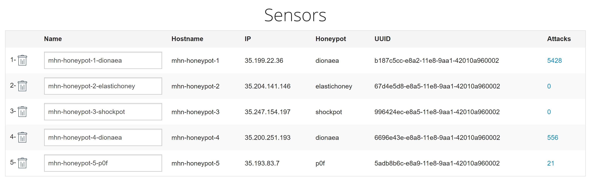
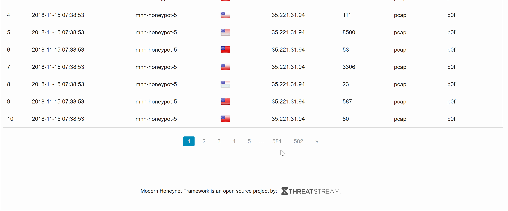

# Week 9
### Chieh-Huang Chen
Time spent: 4 hours spent in total
## Honeypots Deployed

## Any issues you encountered
I had an issue when installing [MHN](https://github.com/threatstream/mhn) where I needed permission to retrieve a repository from Hurricane Labs. I resolved this conflict after finding out that other developers replaced the Github user to couozu in [scripts/install_hpfeeds.sh](https://github.com/threatstream/mhn/blob/master/scripts/install_hpfeeds.sh).
## Summary of the Data Collected

## Any unresolved questions raised by the data collected
None
