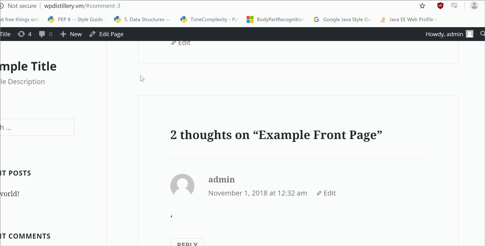
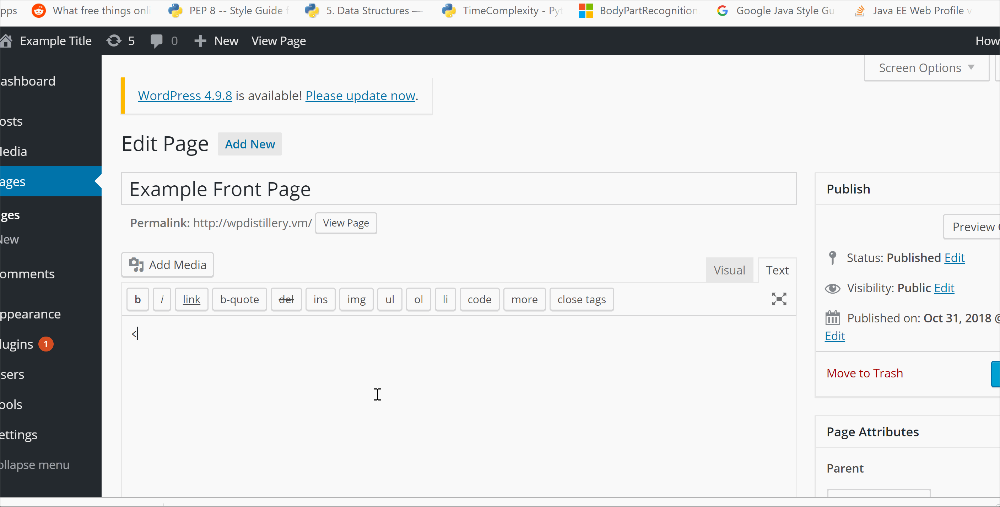
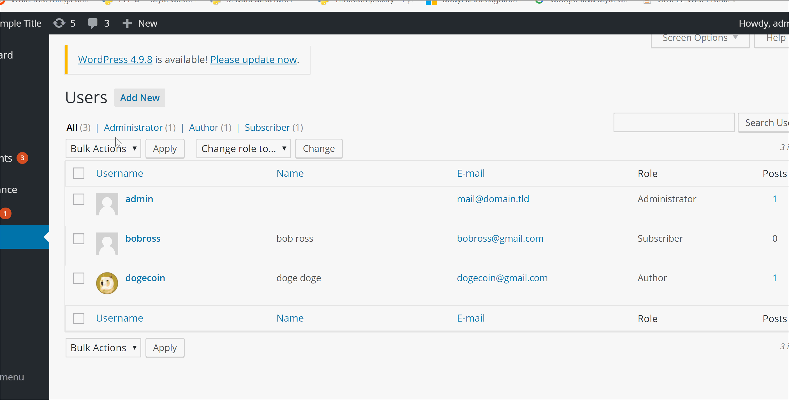

# Project 7 - WordPress Pentesting

Time spent: 3 hours spent in total

> Objective: Find, analyze, recreate, and document **five vulnerabilities** affecting an old version of WordPress

## Pentesting Report

1. Unauthenticated Stored Cross-Site Scripting (XSS)
  - [x] Summary: Submitting a new media online with XSS will cause the website to respond to the XSS.
    - Vulnerability types: XSS
    - Tested in version: 4.2
    - Fixed in version: 4.2.1
  - [x] GIF Walkthrough: 
  - [x] Steps to recreate: Upload a new media on the admin page and then enter the XSS in the caption below.

2. Unauthenticated Stored Cross-Site Scripting (XSS)
  - [x] Summary: Users can submit XSS HTML tags into the comment section and WordPress saves and displays these tags on the website.
    - Vulnerability types: Unauthenticated Stored Cross-Site Scripting (XSS)
    - Tested in version: 4.2
    - Fixed in version: 4.2.1
  - [x] GIF Walkthrough: 
  - [x] Steps to recreate: Send a comment with a XSS on the website.

3. Unauthenticated Stored Cross-Site Scripting (XSS)
  - [x] Summary: Users can submit XSS HTML tags when making new pages on their websites.
    - Vulnerability types: XSS
    - Tested in version: 4.2
    - Fixed in version: 4.2.1
  - [x] GIF Walkthrough: 
  - [x] Steps to recreate: Edit the website on the admin page and add an iframe with a XSS attached as an onload event handler.
3. User Enumeration
  - [x] Summary: WordPress finds all the usernames in WordPress by brute force Author's ID on WordPress.
    - Vulnerability types: User Enumeration
    - Tested in version: 4.2
    - Fixed in version: ?
  - [x] GIF Walkthrough: 
  - [x] Steps to recreate:
    - Run wpscan --url [url] --enumerate u
## Assets
List any additional assets, such as scripts or files

## Resources

- [WordPress Source Browser](https://core.trac.wordpress.org/browser/)
- [WordPress Developer Reference](https://developer.wordpress.org/reference/)

GIFs created with [LiceCap](http://www.cockos.com/licecap/).

## Notes

Describe any challenges encountered while doing the work

## License

    Copyright [2018] [Chieh-Huang Chen]

    Licensed under the Apache License, Version 2.0 (the "License");
    you may not use this file except in compliance with the License.
    You may obtain a copy of the License at

        http://www.apache.org/licenses/LICENSE-2.0

    Unless required by applicable law or agreed to in writing, software
    distributed under the License is distributed on an "AS IS" BASIS,
    WITHOUT WARRANTIES OR CONDITIONS OF ANY KIND, either express or implied.
    See the License for the specific language governing permissions and
    limitations under the License.
